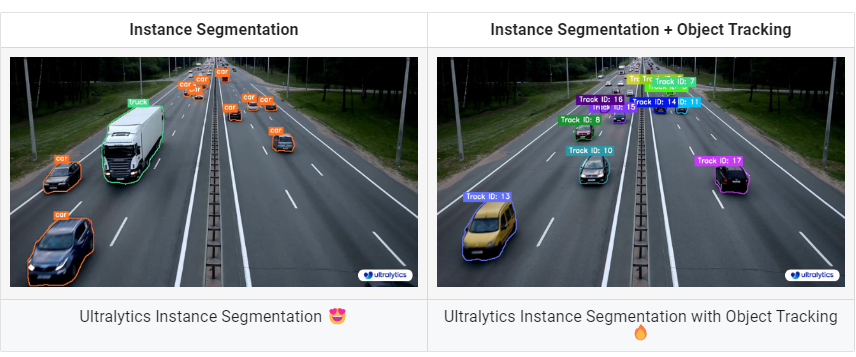
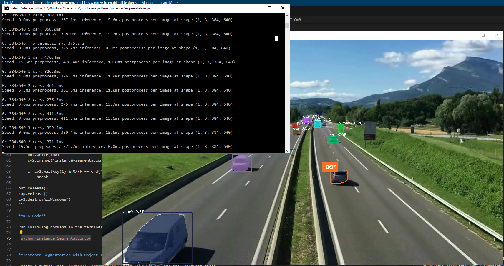
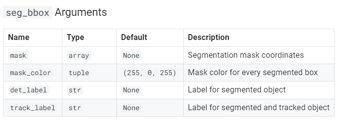

### Lab: Object Segmentation and Tracking using Ultralytics YOLOv8


**Note:** This lab should be done in Window desktop environment.

**What is Instance Segmentation?**

Ultralytics YOLOv8 instance segmentation involves identifying and outlining individual objects in an image, providing a detailed understanding of spatial distribution. Unlike semantic segmentation, it uniquely labels and precisely delineates each object, crucial for tasks like object detection and medical imaging.

There are two types of instance segmentation tracking available in the Ultralytics package:

**Instance Segmentation with Class Objects:** Each class object is assigned a unique color for clear visual separation.

**Instance Segmentation with Class Objects:** Each class object is assigned a unique color for clear visual separation.
Instance Segmentation with Object Tracks: Every track is represented by a distinct color, facilitating easy identification and tracking.

**Samples**



**Install Ultralytics**

Run following command in the terminal to install ultralytics: 

`pip install ultralytics`

**Instance Segmentation: Python Code**

Create a python file `Instance_Segmentation.py` and add following code:

```
import cv2
from ultralytics import YOLO
from ultralytics.utils.plotting import Annotator, colors

model = YOLO("yolov8n-seg.pt")  # segmentation model
names = model.model.names
cap = cv2.VideoCapture("traffic_detection.mp4")
w, h, fps = (int(cap.get(x)) for x in (cv2.CAP_PROP_FRAME_WIDTH, cv2.CAP_PROP_FRAME_HEIGHT, cv2.CAP_PROP_FPS))

out = cv2.VideoWriter('instance-segmentation.avi', cv2.VideoWriter_fourcc(*'MJPG'), fps, (w, h))

while True:
    ret, im0 = cap.read()
    if not ret:
        print("Video frame is empty or video processing has been successfully completed.")
        break

    results = model.predict(im0)
    annotator = Annotator(im0, line_width=2)

    if results[0].masks is not None:
        clss = results[0].boxes.cls.cpu().tolist()
        masks = results[0].masks.xy
        for mask, cls in zip(masks, clss):
            annotator.seg_bbox(mask=mask,
                               mask_color=colors(int(cls), True),
                               det_label=names[int(cls)])

    out.write(im0)
    cv2.imshow("instance-segmentation", im0)

    if cv2.waitKey(1) & 0xFF == ord('q'):
        break

out.release()
cap.release()
cv2.destroyAllWindows()
```

**Run Code**

Run following command in the terminal to run the code:

`python Instance_Segmentation.py`



**Instance Segmentation with Object Tracking: Python Code**

Create a python file `Instance_Segmentation_Object_Tracking.py` and add following code:

```
import cv2
from ultralytics import YOLO
from ultralytics.utils.plotting import Annotator, colors

from collections import defaultdict

track_history = defaultdict(lambda: [])

model = YOLO("yolov8n-seg.pt")   # segmentation model
cap = cv2.VideoCapture("traffic_detection.mp4")
w, h, fps = (int(cap.get(x)) for x in (cv2.CAP_PROP_FRAME_WIDTH, cv2.CAP_PROP_FRAME_HEIGHT, cv2.CAP_PROP_FPS))

out = cv2.VideoWriter('instance-segmentation-object-tracking.avi', cv2.VideoWriter_fourcc(*'MJPG'), fps, (w, h))

while True:
    ret, im0 = cap.read()
    if not ret:
        print("Video frame is empty or video processing has been successfully completed.")
        break

    annotator = Annotator(im0, line_width=2)

    results = model.track(im0, persist=True)

    if results[0].boxes.id is not None and results[0].masks is not None:
        masks = results[0].masks.xy
        track_ids = results[0].boxes.id.int().cpu().tolist()

        for mask, track_id in zip(masks, track_ids):
            annotator.seg_bbox(mask=mask,
                               mask_color=colors(track_id, True),
                               track_label=str(track_id))

    out.write(im0)
    cv2.imshow("instance-segmentation-object-tracking", im0)

    if cv2.waitKey(1) & 0xFF == ord('q'):
        break

out.release()
cap.release()
cv2.destroyAllWindows()
```

**Run Code**

Run following command in the terminal to run the code:

`python Instance_Segmentation_Object_Tracking.py`




