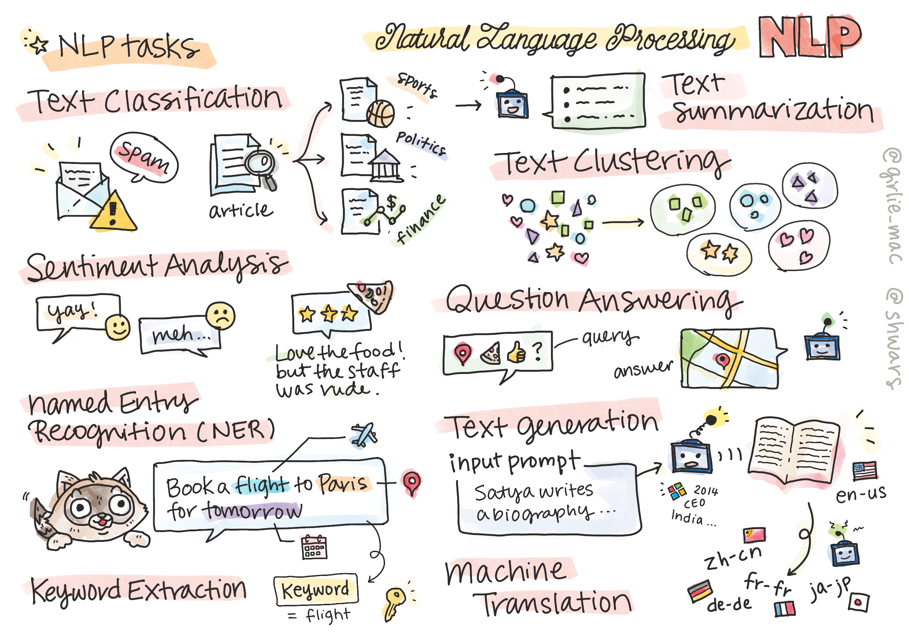

# Natural Language Processing



In this section, we will focus on using Neural Networks to handle tasks related to **Natural Language Processing (NLP)**. There are many NLP problems that we want computers to be able to solve.


Initially, most of NLP tasks were solved using traditional methods such as grammars. For example, in machine translation parsers were used to transform initial sentence into a syntax tree, then higher level semantic structures were extracted to represent the meaning of the sentence, and based on this meaning and grammar of the target language the result was generated. Nowadays, many NLP tasks are more effectively solved using neural networks.

> Many classical NLP methods are implemented in [Natural Language Processing Toolkit (NLTK)](https://www.nltk.org) Python library. There is a great [NLTK Book](https://www.nltk.org/book/) available online that covers how different NLP tasks can be solved using NLTK.

In our course, we will mostly focus on using Neural Networks for NLP, and we will use NLTK where needed.

We have already learned about using neural networks for dealing with tabular data and with images. The main difference between those types of data and text is that text is a sequence of variable length, while the input size in case of images is known in advance. While convolutional networks can extract patterns from input data, patterns in text are more complex. Eg., we can have negation being separated from the subject be arbitrary for many words (eg. *I do not like oranges*, vs. *I do not like those big colorful tasty oranges*), and that should still be interpreted as one pattern. Thus, to handle language we need to introduce new neural network types, such as *recurrent networks* and *transformers*.

## Install Libraries

If you are using local Python installation to run this course, you may need to install all required libraries for NLP using the following commands:

**For PyTorch**
```bash
pip install -r requirements-torch.txt
```
**For TensorFlow**
```bash
pip install -r requirements-tf.txt
```


## GPU Warning

In this section, in some of the examples we will be training quite large models. It is advisable to run notebooks on GPU-enabled computer to minimize waiting time.

When running on GPU, you may experience situations when you run out of GPU memory. During training, the amount of GPU memory consumed depends on many factors, including the minibatch size. If you experience any memory problems - you may try to minimize the minibatch size in the code.

Also, some older versions of TensorFlow do not release GPU memory correctly if you are training multiple models in one Python kernel. In order to use GPU memory cautiously, you may set TensorFlow option to grow GPU memory allocation only when required. You would need to include the following code in your notebooks:

```python
physical_devices = tf.config.list_physical_devices('GPU') 
if len(physical_devices)>0:
    tf.config.experimental.set_memory_growth(physical_devices[0], True) 
```

